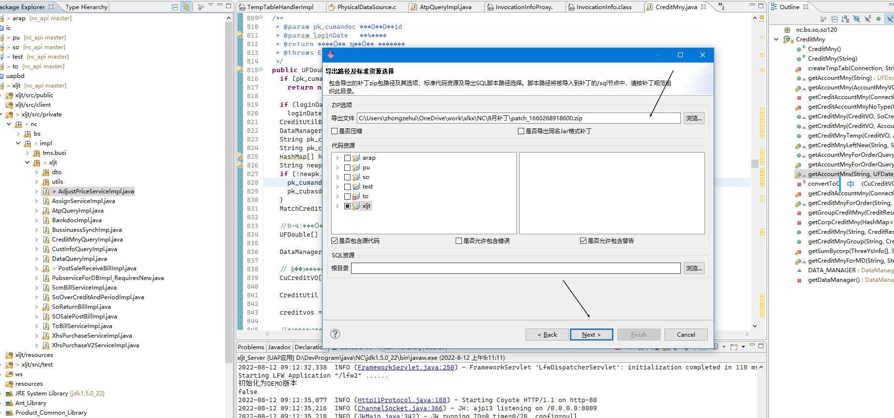
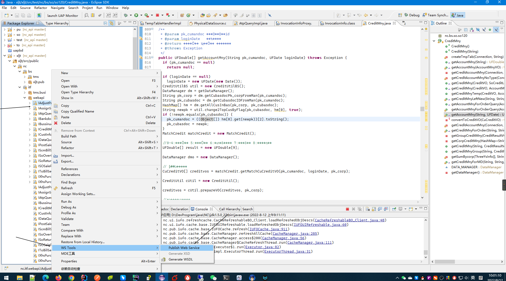

# NC

## 是什么？

    NC来源于用友，是用友开发的一个ERP软件；主要面向企业用户，针对企业信息化需求而生;一共有NC57,NC61,NC63,NC65等版本;

## 有什么？

   主要有应用集成, 财务会计,供应链,人力资源等模块

## 怎么用？

### 开发环境搭建

1. 解压NcHome 
   
   获取一个线上使用的nchome
   
   

2. 启动NC开发工具: eclipse3.8.2


3. 新建开发项目


输入开发对应的模块, 测试的话,可以随便输入一个名称/模块


4. 配置环境信息

打开首选项


配置nchome路径、数据源信息


配置运行模块的信息


配置客户端连接地址和端口


编译版本配置：

    NC57使用的是jdk1.5 ，所以对应的版本是1.5


5. 配置完成后，右键新增的项目，debug as uap中间件


ps：UAP中间件是nc的后端服务

下一步是启动UAP客户端


选择账套和公司， 输入对应的账号和密码，登录nc系统， 开发环境搭建完毕；


### 开发项目

#### 项目结构


**目录结构:**

```txt
D:\DEVPROGRAM\JAVA\NC\ECLIPSE\XLKX\NC_API\XLJT
+---xljt
    |   .classpath
    |   .gitignore
    |   .module_prj
    |   .project
    |   manifest.xml
    |   
    +---.settings
    |                   
    +---lib
    |       fastjson-1.2.75.jar
    |       
    +---META-INF
    |       module.xml
    |       
    +---null
    |   \---CACHE
    |           cachedb_design.lck
    |           cachedb_design.log
    |           cachedb_design.properties
    |           
    +---out
    |   |   .gitignore
    |   |   
    |   \---resources
    |           .gitempty
    |           
    +---resources
    |       .gitempty
    |                   
    \---xljt
        |                       
        +---META-INF
        |       
        +---resources
        |       .gitempty
        |       
        +---src
        |   +---client
        |   |       
        |   +---private
        |   |                       
        |   +---public
        |   |                       
        |   \---test
        |                           
        \---ws
```

**文件夹作用:**

- meta-inf:存放模块描述信息,接口描述文件

- lib: 第三方jar包

- client: 客户端代码

- public: 接口,vo类,公共代码

- private: 接口实现类

#### 补丁整理

补丁:在nc开发中,开发功能输出的文件就是补丁, 包含代码,配置文件等等;

如何整理补丁到nc中,实现功能?

1. 选择补丁文件,右键->export


2. export弹窗选择other->UAPx6补丁包(没有nc5的开发工具,只能选这个了,不过向下兼容)
   
   

3. 输入补丁名称
   
   

4. 下一步是next->next, 选择导出补丁的位置
   
   
   
   

5. 最后finish就可以了


补丁是一个zip压缩包，把压缩包交给NC运维处理即可


### 外部系统接口开发

#### 简介

NC开发外部系统接口常用的方式：

- 应用集成平台

- WebService接口


两种方式优劣

- 集成平台，处理方便，基本不用写代码，只要数据处理不算太复杂都可以胜任，但是处理复杂的逻辑，还有指定返回结果会比较困难，返回结果的数据类型只能是xml

- WebService接口可以自定定义接口处理逻辑，数据内容翻译逻辑等等，入参判断，业务处理，返回接口定义比较灵活，但是需要自己编码，会比较麻烦


#### 集成平台接口开发步骤

略。。。


#### WS接口开发步骤

- 定义java接口，编写接口实现类

- 生成wsdl文件

- 部署接口


以西红市订单接口为例,编写接口类


生成wsdl文件步骤



选择对应的upm文件


upm文件编写范例

```xml
<?xml version='1.0' encoding='UTF-8'?>
<module name="xljt">
	<public>
        <component remote="true" singleton="true" tx="CMT">
            <interface>nc.itf.webapi.IAssignService</interface>
            <implementation>nc.impl.xljt.AssignServiceImpl</implementation>
            <extension class="nc.uap.ws.deploy.OxbWSExtensionProcessor">
				<wsdl>/nc/itf/webapi/IAssignService.wsdl</wsdl>
				<address>/nc.itf.webapi.IAssignService</address>
			</extension>
        </component>
	</public>
	
</module>
```

选择接口的实现类


然后finish就可以了


部署接口步骤

先导出补丁,把接口代码放到nchome里面


补丁内容要包含java代码, upm文件,wsdl文件


把补丁zip内容放到nchome后,  执行%nchome%\bin\ncSysConfig.bat


点击`部署EJB`, 等待部署完成


部署完成会有弹窗提示


接口测试:

启动中间件后, 访问[localhost/uapws/service](http://localhost/uapws/service)


找到测试的接口, 然后复制接口地址


使用webservice接口测试工具SOAP UI ,进行测试


